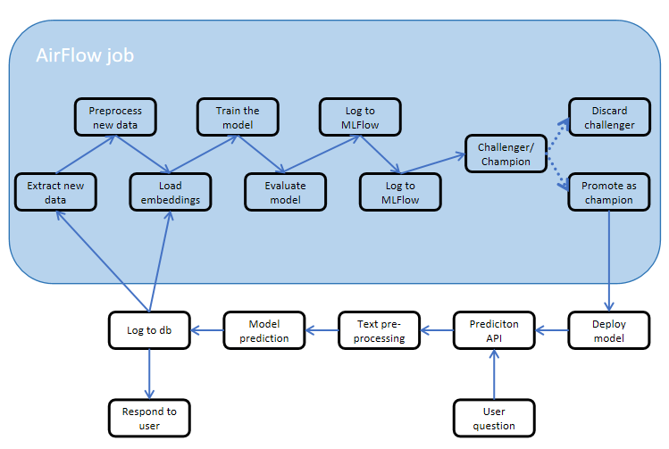

# Quora Post Moderation System: ML-Powered Detection of Insincere Questions
**Author**: Anton Yurchenko

---

## Abstract

This project introduces a machine learning-based system for moderating user-submitted questions on the Quora platform by detecting insincere or provocative content. The goal is to automate the identification of questions that violate community guidelines, reducing manual moderation effort while maintaining platform integrity. The system leverages a transformer-based text classification model and is structured as a modular pipeline that supports automated data processing, model training, and deployment. Designed with scalability and maintainability in mind, the architecture enables seamless updates and performance monitoring. The effectiveness of the model is evaluated using standard classification metrics such as precision, recall, and F1-score.

---

## Overview

There is a growing need to classify user posts on social networks as those that are benevolent and those that are intended to insult, provoke or spread misinformation. Manually identifying such content is time-consuming and inconsistent. An automated system is needed to detect and classify insincere questions at scale. Thus, the objective of this project is to design and deploy a machine learning-powered system capable of automatically identifying insincere questions on the Quora platform with high precision and recall.

---

## Success Metrics

This project emphasizes operational metrics rather than business metrics, as it will not be deployed in production. Logged technical metrics will include:

- Model Promotion Automation
- Weekly Retraining Success Rate
- Model Drift Detection
- New Data Ingestion Lag

---

## Requirements & Constraints

### Functional Requirements

1. **Automatic Question Moderation**  
   Classify questions in real-time as sincere or insincere.

2. **User Prediction API**  
   Expose a REST API for question classification.

3. **Human-in-the-Loop Feedback**  
   Moderators provide feedback to improve future model performance.

4. **Regular Model Retraining**  
   Retrain the model weekly using newly labeled data.

5. **Champion–Challenger Deployment Logic**  
   Promote new models if they outperform the current production model.

6. **Support for Dynamic Data Ingestion**  
   Store new questions, predictions, and feedback in a central database.

### Non-Functional Requirements

- **Containerization** of all services.
- **Automation** of preprocessing, training, evaluation, and deployment.
- **Monitoring** of metrics and drift detection.

### In Scope

- Training a BiLSTM/GRU model with attention using pretrained embeddings.
- Data preprocessing: tokenization, lemmatization, embedding matrix generation.
- Weekly retraining pipeline.
- RESTful prediction API.
- MLflow for logging and versioning.
- Airflow DAG for orchestration.
- Champion–Challenger deployment logic.
- PostgreSQL for storage.
- Dockerized microservices.
- Basic logging and monitoring.

### Out of Scope

- Production-grade deployment (Kubernetes, CI/CD)
- Semantic search with Chroma
- Real-time feedback interfaces (moderator GUI)
- A/B testing and drift detection alerts
- Authentication and access control
- Distributed training
- Full-scale monitoring (Grafana, Prometheus)
- Real-time data streaming

---

## Methodology

### Problem Statement

We frame this as a **binary supervised classification problem** to detect insincere questions.  
- **Input**: Question text  
- **Output**: Binary label (0 = sincere, 1 = insincere)

### Data

We use the [Quora Insincere Questions Classification dataset](https://www.kaggle.com/competitions/quora-insincere-questions-classification) from Kaggle with 1.3M labeled questions.

**Data schema**:
- `qid`: unique ID
- `question_text`: user-submitted question
- `target`: label (0 or 1)

Simulated updates will involve chunking this dataset and gradually injecting new data into the pipeline.

### Techniques

- **Embeddings**: GloVe, FastText, Paragram
- **Architecture**: BiLSTM + GRU + Attention
- **Loss**: Binary cross-entropy
- **Preprocessing**:
  - Remove punctuation and stopwords
  - Tokenization and lemmatization via spaCy
  - Padding and index mapping
  - Dataset balancing via undersampling if needed

### Experimentation & Validation

We use a **90/10 train/validation split**.

**Metrics**:
- **F1 Score** (primary)
- Precision
- Recall
- Accuracy (secondary)

---

## Human-in-the-Loop

Moderators will review borderline or flagged questions and provide corrected labels. This feedback is stored and used during weekly retraining to improve model performance and adaptability.

---

## Implementation

We propose a modular MLOps system to manage the entire ML lifecycle from ingestion to deployment.

  
*On this plot, the rough architecture of the pipeline is visualized.*

- **Prediction API**: Flask-based REST API to serve predictions.
- **Model**: BiLSTM + GRU + Attention with pretrained embeddings.
- **Airflow DAG**: Orchestrates weekly training, logging to MLflow, and model promotion.
- **Data Storage**:
  - PostgreSQL for raw data, predictions, feedback
  - ChromaDB for vector representations (optional)
  - S3 for storing embeddings and artifacts

All components are **Dockerized microservices**, communicating over REST APIs.

---

